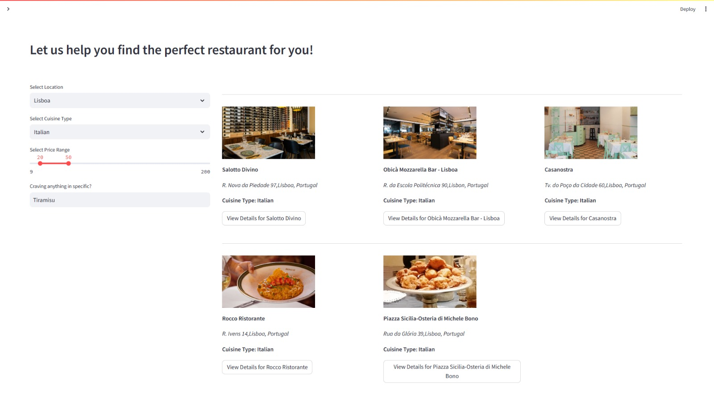

<br/>
<p align="center">
  <a href="https://github.com/shaulleo/FlavourFlix">
    
  </a>

  <h2 align="center">FlavourFlix - Capstone Project</h2>

  <p align="center">
    Discover. Taste. Repeat
    <br/>
    <br/>
    <a href="https://flavourflixx.wixsite.com/flavour-flix">FlavourFlix website</a>

  </p>
</p>


   

This repository contains the complete project designed for the curricular unit "Capstone Project", by Bruno Moreira, Carolina Shaul, Madalena Frango and Guilherme Carriço from the Bachelor Degree in Data Science. 

## About The Project

<p align="center">
  
</p>

#### Description and Motivation

FlavourFlix represents the result of the Capstone Project undertaken as part of the bachelor’s degree in data science. 
It is intended, in this project, to incorporate a diversified set of data science tools and techniques, concerning namely web scraping, data retrieval and generation, machine learning, text mining, natural language processing, API integration, and large language models.

The idea behind FlavourFlix was to integrate the social network elements present in food and restauration-related platforms such as TheFork and Zomato combined with the recommendation capabilities that distinguish Netflix and YouTube, for example, by ultimately enabling an end-user to obtain customized restaurant recommendations.

#### Features

With this in mind, a broad spectrum of features were implemented. To name a few, in the app, users can discover the closest restaurants, search restaurants based on specified criteria, and receive customized restaurant suggestions based on their personal information and tastes, through Filomena, the FlavourFlix AI assistant. Users can also uncover their "Food Personality" and simulate reservations with a restaurant.


<div align="center">
  
  
  
  
    
</div>


## Built With

This project aims to showcase our abilities in integrating multiple technologies within Data Science, Machine Learning and Generative AI fields. To be exact, FlavourFlix was built with:

- 👨🏻‍💻 __Python__: As the base programming language.
- 💻 __Streamlit__: To create the web app of FlavourFlix.
- 🎀 __HTML & CSS__: To embelish the web app in Streamlit.
- 🔗🦜 __LangChain & OpenAI__: To generate data for the project and build the models behind the virtual assistant Filomena.
- 🗺️ __Bings Maps Dev__: To perform geocoding operations and deal with locations.
- 🗃️ __Grettle & Mockaroo__: To generate artificial data.
- 🍴 __scraperAPI & Apify__: To scrape data for FlavourFlix.
- 💽 __DETA__: Database to store FlavourFlix' users authentication.


## Getting Started

To set up this project locally, fork the repository and following these steps.

### Prerequisites and Project Set up

🧩 __OpenAI API Key__: It is necessary to have an OpenAI Api Key to use the LLM's. It is essential for the Filomena functionality.

 💽 __DETA Key__: The Deta Key is necessary to access a Deta Database, which is used to store the FlavourFlix' users login.

🗺️ __Bing MAPS API Key__: It is necessary to have a Bing Maps API key from Bing Maps Dev Center to perform geocoding operations, determine user current location and travel times between locations.

⚠️ The API keys must be stored in a file named .env in the following format: 

``` 
OPENAI_API_KEY = 'Your OpenAI key'
DATA_PATH = '/code'
BING_MAPS_API_KEY = 'Your Bing Maps API key'
MAPS_BASE_URL='http://dev.virtualearth.net/REST/v1/Locations'
DETA_KEY = 'Your DETA key'
```
This procedure ensures the file is inacessible to others and that the API keys do not inccur in additional costs.

> Note: It is especially important to ensure that the variables in the __.env__ file are named as demonstrated in the code above. This specific name aligns with the Settings class in the util.py file, which is a specialization of the BaseSettings from the pydantic-settings package.

It is also necessary to install in the project environment the packages within the requirements files. The type of requirements depend on your computer. Use:

> __requirements.txt__: If you are using Windows. <br>
__requirementsb.txt__: If you are using a Mac.

After ensuring all of these elements are satisfied, the project is set up.


## Usage

This project can be used to ...


_For examples on how to, namely, effectively use the Filomena page please refer to the [Use Cases](https://example.com) and [Prompt Templates](https://example.com)_


## Authors

* [Carolina Shaul](https://github.com/shaulleo) - *Project Management and Development, with most focus building the application back-end and the Filomena ChatBot.*
* [Madalena Frango](https://github.com/madalenafrango) - *Project Development, focusing the most on building the app and creating all the marketing tools such as FlavourFlix' Instagram and website.*  
* [Bruno Moreira](https://github.com/bmoreira14) - *Project Development, mostly by generating the appropriate data through distinct tools and ensuring its validity.*
* [Guilherme Carriço](https://github.com/GuihermeCarric) - *Project Development mostly focused on data exploration and cleaning, as well as building machine learning models.*


## Acknowledgements

* [SnakeByte](https://github.com/Frost-Codes/Streamlit-Authentication/blob/main/main.py): Sign Up and Login system.
